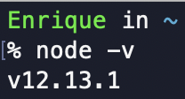

# Read me

## Requirements

This project requires your machine to have Node.js and npm installed.
If you dont have Node.js installed, you can download it [here.](https://nodejs.org/en/ "Node Download")

Also, this project assumes profficiency with the command line and git.

Note: The codes used here are for macOS.

### Verify Node is installed

Open a terminal window and run this command.

```
node -v
```

If Node is installed in your machine, the command should return the version of it. For example, my machine has version 12.13.1 installed.



If the command does not return a version, then Node is not installed. Do not proceed unless Node is installed.

## Download project files

Once you have verified Node.js is installed, download the project files using the 'clone or download' button.


You can choose to download a zip file containing the project files, or you can copy the project-url to your clipboard to use in the command line.


## Cloning the project repository through the command line

Note: This approach will clone the project repository into the directory you're in. I recommend navigating to your Desktop directory first.

```
cd ~/Desktop
```

Once you're in the desired directory, run the following code

```
git clone https://github.com/riquenandez/vue-application.git
```

### Navigate to 'vue-application' directory

If you downloaded or cloned the directory into your Desktop directory, run the following code:

```
cd ~/Desktop/vue-application
```

Alternatively, you can follow the same idea if you chose a different directory.

```
cd <your path to 'vue-application' directory>
```

Now, you are ready to continue to Project setup

## Project setup

Before running these codes, make sure you are in the 'vue-application' directory

### Install project dependencies

```
npm install
```

### Run the application on localhost

```
npm run serve
```

## Success!

If everything worked correctly, you should see something similar to this in your terminal window.


If you are using VS code you can click the link displayed. Artenatively, you can copy and paste the localhost link into your browser.

### Local host link

```
http://localhost:8080/
```
